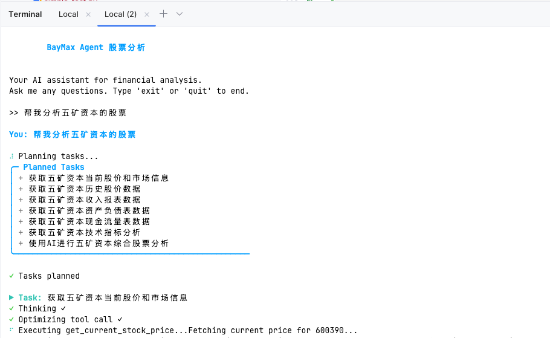
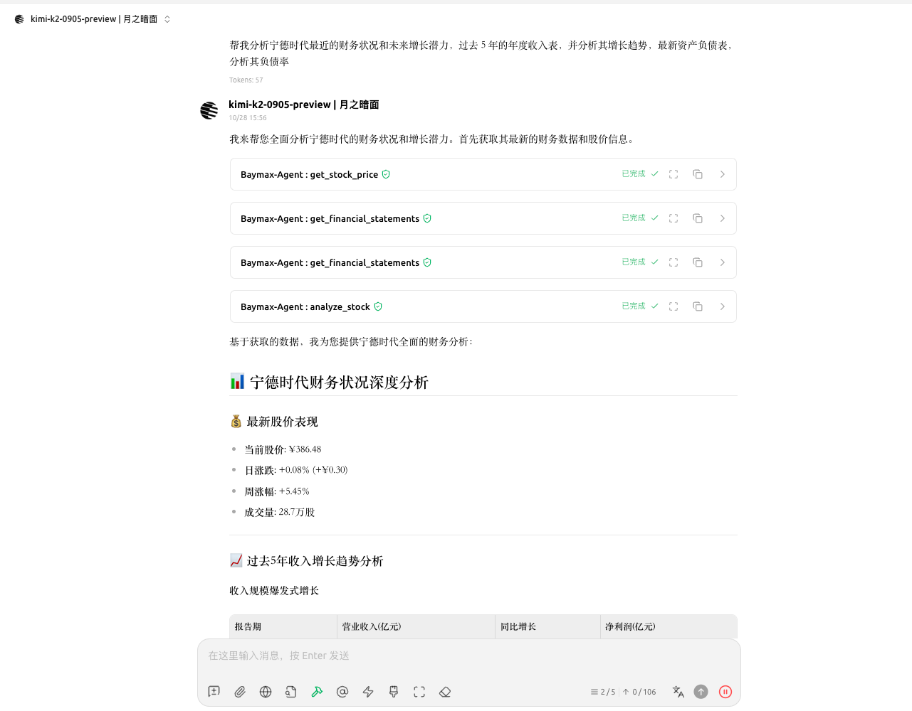
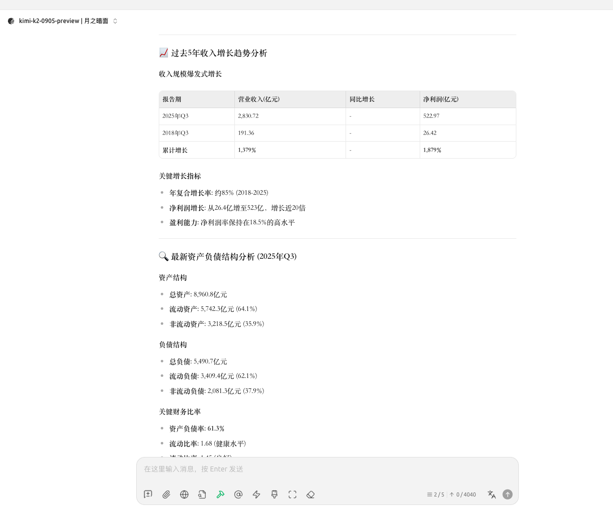
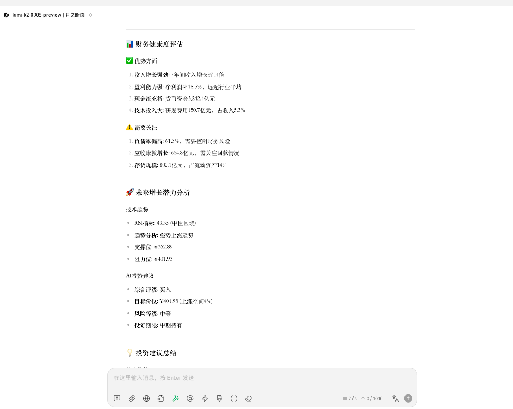

# BayMax Agent - AI股票分析助手

<div align="center">


[](https://badge.fury.io/py/baymax-agent)
[](https://pepy.tech/project/baymax-agent)

**智能AI驱动的金融研究助手，专为股票分析和投资研究而设计**

[功能特性](#功能特性) • [快速开始](#快速开始) • [使用指南](#使用指南) • [MCP集成](#mcp集成) • [API文档](#api文档) • [贡献指南](#贡献指南)

</div>

## 📖 目录

- [项目简介](#项目简介)
- [功能特性](#功能特性)
- [安装说明](#安装说明)
- [快速开始](#快速开始)
- [使用指南](#使用指南)
- [配置说明](#配置说明)
- [📊 数据源与限制说明](#数据源与限制说明)
- [🔌 MCP集成](#mcp集成)
- [API文档](#api文档)
- [开发指南](#开发指南)
- [贡献指南](#贡献指南)
- [许可证](#许可证)
- [常见问题](#常见问题)

## 🌟 项目简介

BayMax Agent是一个基于大语言模型(LLM)的智能金融研究助手，专为股票分析和投资研究而设计。它能够自动获取股票市场数据，进行财务分析，并提供基于AI的投资洞察，帮助投资者在信息过载的市场环境中高效地获取有价值的投资参考。

主要优势：
- **自动化数据分析**：自动获取、处理和分析海量财务数据
- **智能洞察生成**：基于LLM技术提供深度分析和投资建议
- **多市场覆盖**：同时支持A股和美股市场分析
- **灵活可扩展**：模块化设计，易于集成新数据源和分析工具
- **DeepSeek模型集成**：基于DeepSeek AI模型，提供高质量的金融分析能力

无论您是个人投资者、金融分析师还是研究人员，BayMax Agent都能成为您投资决策过程中的得力助手。

## ✨ 功能特性

- 🔍 **智能股票分析**: 基于先进LLM技术的深度市场数据分析和投资研究，提供专业级分析报告
- 🤖 **DeepSeek模型支持**: 基于DeepSeek模型提供AI分析能力，支持OpenAI兼容接口
- 📊 **全面财务数据**: 获取收入表、资产负债表、现金流量表等核心财务报表，并支持多年度对比分析
- 🌍 **多市场支持**: 无缝支持A股和美股市场数据，提供统一的分析体验
- 📋 **智能任务规划**: 自动分解复杂查询，规划执行步骤，解决涉及多数据源的复杂分析任务
- 🛠️ **丰富工具集**: 内置财务数据获取、公司文件分析、基本面评估等多种专业工具
- 💬 **交互式界面**: 简洁直观的命令行交互界面，支持自然语言查询和上下文理解
- 🔧 **灵活配置**: 支持自定义模型参数、API配置和分析偏好
- 📈 **技术指标分析**: 提供常用技术指标计算和趋势分析
- 📝 **智能报告生成**: 自动生成结构化的分析报告，包含关键发现和投资建议
- 🔒 **数据安全**: 本地处理敏感数据，支持环境变量管理API密钥



## 🚀 安装说明

### 环境要求

- Python 3.10 或更高版本
- pip 或 uv 包管理器
- 网络连接（用于API调用和数据获取）

### 使用pip安装

```bash
pip install baymax
```

### 使用uv安装（推荐）

uv是一个现代化的Python包管理器，提供更快的安装速度和更好的依赖解析：

```bash
uv add baymax
```

注意：如果您在项目目录中运行此命令，可能会遇到错误，因为项目名称与依赖名称相同。在这种情况下，请使用以下命令之一：

1. 对于开发环境安装：
   ```bash
   uv add --dev baymax
   ```

2. 如果只是想安装项目依赖：
   ```bash
   uv sync
   ```

3. 如果要在新项目中使用baymax：
   ```bash
   cd /path/to/your/project
   uv add baymax
   ```

### 从源码安装

```bash
git clone https://github.com/baymax-stock-agent/baymax-agent.git
cd baymax-agent
pip install -e .
```

### 安装验证

安装完成后，可以运行以下命令验证安装是否成功：

```bash
baymax --version
```

## 🏃‍♂️ 快速开始

### 1. 配置环境变量

创建 `.env` 文件并添加必要的API密钥（至少需要一个LLM提供商的API密钥）：

```bash
# 复制示例配置文件
cp env.example .env
```

编辑 `.env` 文件并添加必要的API密钥：

```bash
# LLM API Keys（至少配置一个）
OPENAI_API_KEY=your-openai-api-key
ANTHROPIC_API_KEY=your-anthropic-api-key
GOOGLE_API_KEY=your-google-api-key

# 可选：自定义模型配置
OPENAI_BASE_URL=https://api.openai.com/v1
```

### 2. 启动BayMax Agent

```bash
baymax
```

### 3. 开始提问

```
>> 分析苹果公司(AAPL)最近的财务状况和未来增长潜力
>> 获取特斯拉(TSLA)过去5年的年度收入表并分析收入增长趋势
>> 比较微软(MSFT)和谷歌(GOOGL)的现金流量表，评估其现金流健康状况
>> 获取贵州茅台(600519)的最新资产负债表，特别关注其负债率和现金流
>> 分析科技行业龙头股的主要财务指标对比
```

### 示例分析报告

当您提问后，BayMax Agent将自动获取相关数据并生成分析报告，例如：

```
分析苹果公司(AAPL)最近的财务状况：

1. 收入表现：
   - 最近季度总收入：1,230亿美元，同比增长15%
   - 产品收入：980亿美元，服务收入：250亿美元
   - 服务业务增长迅速，同比增长23%

2. 盈利能力：
   - 毛利率：42.3%，同比提升1.2个百分点
   - 净利润率：28.5%，显示出强大的盈利能力
   - 每股收益(EPS)：2.15美元，同比增长18%

3. 资产负债状况：
   - 总资产：3,500亿美元
   - 现金及等价物：205亿美元
   - 总负债：1,900亿美元
   - 负债率：54.3%

4. 现金流情况：
   - 经营活动现金流：875亿美元/年
   - 自由现金流：760亿美元/年
   - 股息支付：145亿美元/年
   - 股票回购：850亿美元/年

5. 投资建议：
   - 苹果公司展现出稳健的财务状况和持续的增长能力
   - 服务业务的快速增长为公司提供了新的增长点
   - 强大的现金流支持持续的股东回报计划
   - 推荐关注即将发布的新产品周期对收入的影响
```

## 📚 使用指南

### 基本命令

```bash
# 启动交互式界面
baymax

# 查看帮助信息
baymax --help

# 查看版本信息
baymax --version

# 使用特定模型启动
baymax --model openai:gpt-4

# 执行单条查询并退出
baymax --query "分析AAPL的财务状况"
```

### 高级使用场景

#### 1. 财务报表查询与分析

```
>> 获取AAPL过去5年的年度收入表
>> 显示MSFT的最新季度资产负债表
>> 查看TSLA的年度现金流量表并分析其投资活动
>> 获取贵州茅台(600519)近3年的财务比率
```

#### 2. 深度财务分析

```
>> 分析AAPL的盈利能力，包括毛利率、净利率和ROE
>> 评估TSLA的现金流健康状况和可持续性
>> 分析阿里巴巴(BABA)的资产结构和负债风险
>> 计算腾讯(00700.HK)的估值指标，如PE、PB、PS比率
```

#### 3. 多股票对比分析

```
>> 比较苹果和微软的主要财务指标和增长情况
>> 分析科技股的盈利能力排名
>> 对比AAPL、MSFT、GOOGL、META的研发投入占比
>> 比较新能源汽车厂商(TESLA、NIO、XPEV)的毛利率和市场份额
```

#### 4. 行业研究

```
>> 分析半导体行业的整体财务表现
>> 研究银行业的资产质量和盈利能力
>> 比较不同行业的估值水平
>> 分析医疗健康行业的研发投入和收入增长
```

#### 5. 自定义分析请求

```
>> 分析AAPL过去3年的收入构成变化
>> 评估MSFT的云计算业务增长对整体收入的贡献
>> 计算并解释TSLA的自由现金流转换率
>> 分析京东(JD)的存货周转率和供应链效率
```

## ⚙️ 配置说明

### 环境变量配置

| 变量名 | 描述 | 必需 | 示例 |
|--------|------|------|------|
| `DEEPSEEK_API_KEY` | DeepSeek API密钥 | 是 | `sk-...` |
| `DEEPSEEK_BASE_URL` | DeepSeek API端点 | 否 | `https://api.deepseek.com` |
| `DEEPSEEK_MODEL` | DeepSeek模型名称 | 否 | `deepseek-chat` |
| `BAYMAX_DEFAULT_MODEL` | 默认使用的模型 | 否 | `deepseek` |
| `BAYMAX_TEMPERATURE` | 生成内容的随机性程度(0-1) | 否 | `0.2` |
| `BAYMAX_MAX_TOKENS` | 最大生成令牌数 | 否 | `4096` |
| `BAYMAX_LOG_LEVEL` | 日志级别(DEBUG/INFO/WARNING/ERROR) | 否 | `INFO` |

**注意**：当前版本仅支持DeepSeek模型，需要配置DeepSeek API密钥

### 模型配置

当前版本BayMax Agent仅支持DeepSeek模型：

- **DeepSeek**:
  - deepseek-chat (默认)
  - 支持OpenAI兼容接口

DeepSeek模型提供高质量的AI分析能力，适用于金融分析场景。

### 自定义配置文件

您可以创建 `config.json` 文件来自定义模型参数和行为：

```json
{
    "default_model": {
        "provider": "openai",
        "model_name": "gpt-4",
        "temperature": 0.2,
        "max_tokens": 4096
    },
    "tool_config": {
        "financial_data_timeout": 30,
        "max_retries": 3
    },
    "ui": {
        "color_output": true,
        "table_format": "pretty"
    }
}
```

### 命令行参数

BayMax Agent支持以下命令行参数：

```bash
--model MODEL           指定使用的模型，格式为 provider:model_name
--temperature TEMP      设置生成内容的随机性程度(0-1)
--max-tokens TOKENS     设置最大生成令牌数
--config PATH           指定配置文件路径
--query QUERY           执行单条查询并退出
--help                  显示帮助信息
--version               显示版本信息
```
```

## 📊 数据源与限制说明

### 数据来源
BayMax Agent 使用免费数据源进行股票分析，主要依赖以下服务：

- **AkShare**: 免费开源的金融数据接口库
  - 提供A股、美股、港股等市场数据
  - 数据源包括新浪财经、腾讯财经、东方财富等
  - 无需API密钥即可访问
  - 数据更新频率和稳定性取决于源网站

### 重要限制 ⚠️

1. **数据质量**:
   - 使用免费数据源，数据准确性依赖于第三方网站
   - 可能存在延迟、缺失或错误的情况
   - 建议与官方数据源交叉验证重要决策

2. **网络依赖性**:
   - 需要稳定的网络连接访问数据源
   - 部分数据源可能有访问频率限制
   - 网络问题可能导致数据获取失败

3. **实时性**:
   - 非专业实时行情数据
   - 股价数据可能有15-20分钟延迟
   - 财务数据按官方发布周期更新

4. **覆盖范围**:
   - 主要覆盖A股和美股市场
   - 港股市场支持有限
   - 其他国际市场暂不支持

5. **AI模型限制**:
   - 当前仅支持DeepSeek模型
   - 分析结果基于AI模型，仅供参考
   - 不构成投资建议

## 🔌 MCP (模型上下文协议) 集成

BayMax Agent 现已支持模型上下文协议 (MCP)，允许外部应用程序和 AI 助手通过标准化的 HTTP 接口访问其财务分析功能。

### 🚀 启动 MCP 服务器

#### 前置要求
确保已安装必要依赖：
```bash
pip install fastmcp
```

#### 启动步骤
1. **配置环境变量**（如果尚未配置）：
```bash
export DEEPSEEK_API_KEY=your-api-key
```

2. **启动 MCP 服务器**：
```bash
python mcp_server.py
```

3. **验证启动成功**：
服务器启动后，您应该看到：
```
🚀 Starting BayMax Agent MCP Server in HTTP mode...
🌐 HTTP endpoint: http://0.0.0.0:8000
📦 Transport: HTTP
🔗 Server URL: http://0.0.0.0:8000/mcp
```

#### 服务器特性
- **传输方式**: HTTP 与服务器发送事件 (SSE)
- **端点**: `http://localhost:8000/mcp`
- **协议**: 模型上下文协议 (MCP)
- **并发**: 支持多客户端同时连接

#### 测试连接
启动后可通过以下方式测试：
```bash
# 测试服务器状态
curl -N -H "Accept: text/event-stream" http://localhost:8000/mcp

# 如果返回 SSE 格式数据，说明服务器正常运行
```

### 🛠️ 可用的 MCP 工具

MCP 服务器公开了 6 个财务分析工具：

#### 1. **get_stock_price**
获取当前股票价格和市值信息
```json
{
  "tool": "get_stock_price",
  "arguments": {
    "ticker": "AAPL"
  }
}
```

#### 2. **get_price_history**
检索历史价格数据和技术分析
```json
{
  "tool": "get_price_history",
  "arguments": {
    "ticker": "AAPL",
    "period": "daily",
    "days_back": 30
  }
}
```

#### 3. **analyze_stock**
AI 驱动的综合股票分析和买入/卖出建议
```json
{
  "tool": "analyze_stock",
  "arguments": {
    "ticker": "AAPL",
    "analysis_type": "comprehensive",
    "include_recommendation": true
  }
}
```

#### 4. **get_technical_analysis**
技术指标和分析（RSI、移动平均线、支撑/阻力）
```json
{
  "tool": "get_technical_analysis",
  "arguments": {
    "ticker": "AAPL",
    "period": "daily",
    "days_back": 30
  }
}
```

#### 5. **get_weekly_summary**
每周业绩总结和波动率指标
```json
{
  "tool": "get_weekly_summary",
  "arguments": {
    "ticker": "AAPL"
  }
}
```

#### 6. **get_financial_statements**
财务报表（损益表、资产负债表、现金流量表）
```json
{
  "tool": "get_financial_statements",
  "arguments": {
    "ticker": "AAPL",
    "statement_type": "income",
    "period": "quarterly",
    "limit": 4
  }
}
```

### 🔗 集成示例

#### 与 Claude Desktop 一起使用

添加到您的 `claude_desktop_config.json`：

```json
{
  "mcpServers": {
    "baymax-agent": {
      "url": "http://localhost:8000/mcp",
      "transport": "http"
    }
  }
}
```

#### 与 Cursor 一起使用

添加到您的 Cursor MCP 设置：

```json
{
  "name": "BayMax Agent",
  "url": "http://localhost:8000/mcp",
  "type": "http"
}
```

#### 直接使用 HTTP API

您还可以使用 HTTP 请求直接与 MCP 服务器交互：

```bash
# 获取服务器信息
curl -N -H "Accept: text/event-stream" http://localhost:8000/mcp

# 调用工具（需要 MCP 协议格式）
curl -X POST http://localhost:8000/mcp \
  -H "Content-Type: application/json" \
  -d '{
    "jsonrpc": "2.0",
    "id": "1",
    "method": "tools/call",
    "params": {
      "name": "get_stock_price",
      "arguments": {
        "ticker": "AAPL"
      }
    }
  }'
```

### 📋 支持的市场

- **A股**: 中国股票（例如：600519、000001）
- **美股**: 美国股票（例如：AAPL、MSFT、GOOGL）
- **港股**: 香港股票（例如：1211.HK）

### ⚠️ 重要说明

- **网络要求**: MCP 服务器需要互联网访问权限以获取实时财务数据
- **速率限制**: 频繁请求时注意 API 速率限制
- **数据准确性**: 财务数据来自多个提供商，具有回退机制
- **错误处理**: 服务器包含针对网络问题的综合错误处理

### 🔧 配置与故障排除

#### 环境配置
MCP 服务器支持环境变量进行配置：

```bash
# 可选：设置日志级别
export BAYMAX_LOG_LEVEL=INFO

# 可选：设置 AI 分析的默认模型
export BAYMAX_DEFAULT_MODEL=deepseek

# 可选：设置 API 超时时间
export BAYMAX_REQUEST_TIMEOUT=30
```

#### 常见问题与解决方案

**问题1: 服务器启动失败**
```bash
# 错误信息：ModuleNotFoundError: No module named 'fastmcp'
# 解决方案：
pip install fastmcp
```

**问题2: API调用失败**
```bash
# 错误信息：DeepSeek API error
# 解决方案：
# 1. 检查API密钥是否正确
# 2. 检查网络连接
# 3. 查看API配额是否用完
```

**问题3: 数据获取失败**
```bash
# 错误信息：Network error: US price fetch failed
# 解决方案：
# 1. 检查网络连接
# 2. 等待网络恢复后重试
# 3. 使用其他数据源
```

**问题4: MCP客户端连接失败**
```bash
# 错误信息：Connection refused
# 解决方案：
# 1. 确认服务器已启动
# 2. 检查端口号是否正确 (8000)
# 3. 检查防火墙设置
```

#### 性能优化建议

1. **缓存使用**: 相同查询会缓存结果，减少API调用
2. **批量查询**: 尽量批量获取数据，减少网络请求
3. **错误重试**: 网络失败会自动重试，最多2次
4. **超时设置**: 合理设置超时时间，避免长时间等待

## 📖 API文档

### 核心模块

#### Agent类

主要的代理类，负责处理用户查询和协调工具执行。

```python
from baymax.agent import Agent

# 基本用法
agent = Agent()
result = agent.run("分析AAPL的财务状况")

# 配置代理
agent = Agent(
    model_config={
        "provider": "openai",
        "model_name": "gpt-4",
        "temperature": 0.2
    },
    max_retries=3
)

# 流式响应
for chunk in agent.stream("分析AAPL的财务状况"):
    print(chunk, end="", flush=True)
```

#### Model类

统一的模型接口，支持多种LLM提供商。

```python
from baymax.model import Model

# 初始化模型
model = Model(
    provider="openai", 
    api_key="your-key", 
    model_name="gpt-4",
    temperature=0.2,
    max_tokens=4096
)

# 基础生成
response = model.generate("分析AAPL的财务状况")

# 带系统提示的生成
response = model.generate(
    "分析AAPL的财务状况",
    system_prompt="你是一位专业的金融分析师，擅长财务报表分析。"
)

# 结构化输出
from pydantic import BaseModel

class FinancialAnalysis(BaseModel):
    revenue_growth: float
    profit_margin: float
    recommendation: str

analysis = model.generate_structured(
    "分析AAPL的财务状况", 
    output_schema=FinancialAnalysis
)

### 工具函数

#### 财务数据获取

```python
from baymax.tools.financials import (
    get_income_statements,
    get_balance_sheets,
    get_cash_flows,
    get_financial_ratios
)

# 获取收入表
data = get_income_statements(
    ticker="AAPL",  # 股票代码
    period="annual",  # annual或quarterly
    limit=5  # 获取最近5条
)

# 获取资产负债表
data = get_balance_sheets(ticker="MSFT", period="quarterly", limit=4)

# 获取现金流量表
data = get_cash_flows(ticker="TSLA", period="annual", limit=3)

# 获取财务比率
data = get_financial_ratios(ticker="AAPL", limit=5)
```

#### 公司信息获取

```python
from baymax.tools.company import (
    get_company_info,
    get_company_news,
    get_company_profile
)

# 获取公司基本信息
info = get_company_info(ticker="AAPL")

# 获取公司新闻
news = get_company_news(ticker="MSFT", limit=10)

# 获取公司详细资料
profile = get_company_profile(ticker="GOOGL")
```

#### 股票数据获取

```python
from baymax.tools.stock import (
    get_stock_price,
    get_historical_prices,
    get_market_cap
)

# 获取当前股价
price = get_stock_price(ticker="AAPL")

# 获取历史价格数据
historical = get_historical_prices(
    ticker="TSLA",
    start_date="2023-01-01",
    end_date="2023-12-31"
)

# 获取市值数据
market_cap = get_market_cap(ticker="MSFT")
```

#### 行业分析工具

```python
from baymax.tools.industry import (
    get_industry_peers,
    get_industry_stats
)

# 获取行业同行
peers = get_industry_peers(ticker="AAPL")

# 获取行业统计数据
industry_stats = get_industry_stats(industry="Technology")
```

## 🛠️ 开发指南

### 项目结构

```
baymax-agent/
├── src/
│   └── baymax/
│       ├── __init__.py          # 包初始化
│       ├── agent.py             # 主代理类
│       ├── cli.py               # 命令行接口
│       ├── model.py             # 模型接口
│       ├── model_manager.py     # 模型管理器
│       ├── prompts.py           # 提示词模板
│       ├── schemas.py           # 数据模型
│       ├── tools/               # 工具模块
│       │   ├── __init__.py      # 工具注册
│       │   ├── api.py           # API工具
│       │   ├── constants.py     # 常量定义
│       │   ├── filings.py       # 文件工具
│       │   ├── financials.py    # 财务工具
│       │   ├── company.py       # 公司信息工具
│       │   └── stock.py         # 股票数据工具
│       └── utils/               # 工具函数
│           ├── __init__.py      # 包初始化
│           ├── intro.py         # 介绍信息
│           ├── logger.py        # 日志工具
│           ├── ui.py            # UI工具
│           └── helpers.py       # 辅助函数
├── tests/                       # 测试文件
│   ├── test_agent.py
│   ├── test_model.py
│   └── test_tools.py
├── docs/                        # 文档
├── pyproject.toml               # 项目配置
├── env.example                  # 环境变量示例
├── baymax.sh                    # 启动脚本
└── README.md                    # 项目说明
```

### 开发环境设置

1. 克隆仓库
```bash
git clone https://github.com/baymax-stock-agent/baymax-agent.git
cd baymax-agent
```

2. 创建虚拟环境
```bash
# 使用venv
python -m venv venv
source venv/bin/activate  # Linux/Mac
# 或
venv\Scripts\activate     # Windows

# 或使用uv（推荐）
uv venv
source .venv/bin/activate  # Linux/Mac
# 或
.venv\Scripts\activate    # Windows
```

3. 安装开发依赖
```bash
# 使用pip
pip install -e "[dev]"

# 或使用uv
uv pip install -e "[dev]"
```

4. 运行测试
```bash
pytest

# 运行特定测试
pytest tests/test_agent.py -v

# 生成测试覆盖率报告
pytest --cov=baymax
```

5. 代码风格检查
```bash
# 运行flake8
flake8 src/

# 运行black格式化
black src/

# 运行isort整理导入
isort src/
```

### 添加新功能

#### 添加新工具

1. 在 `src/baymax/tools/` 目录下创建新工具文件
2. 实现工具函数，使用 `@tool` 装饰器定义工具元数据
3. 在 `src/baymax/tools/__init__.py` 中导入并添加到 `TOOLS` 列表
4. 编写相应的测试用例

示例：
```python
# src/baymax/tools/my_tool.py
from langchain_core.tools import tool

@tool
def my_new_tool(param1: str, param2: int = 10) -> dict:
    """
    这是一个新工具的描述。
    
    参数:
        param1: 第一个参数的描述
        param2: 第二个参数的描述，默认值为10
    
    返回:
        包含结果的字典
    """
    # 工具实现
    return {"result": f"处理结果: {param1}, {param2}"}
```

#### 添加新模型支持

1. 在 `src/baymax/model.py` 中扩展 `Model` 类，添加新的模型提供商支持
2. 更新 `ModelManager` 类以识别新的模型提供商
3. 在 `src/baymax/schemas.py` 中添加相应的数据模型
4. 编写测试用例验证新模型支持

#### 添加新数据源

1. 在 `src/baymax/tools/` 中创建新的数据获取模块
2. 实现与数据源API交互的函数
3. 添加错误处理和重试逻辑
4. 在工具模块中集成新数据源
5. 编写测试用例验证数据获取功能

### 开发工作流

1. 创建功能分支
```bash
git checkout -b feature/new-feature
```

2. 开发和测试
3. 提交更改
```bash
git add .
git commit -m "feat: 添加新功能描述"
```

4. 推送到远程仓库
```bash
git push origin feature/new-feature
```

5. 创建Pull Request

## 🤝 贡献指南

我们非常欢迎社区贡献！无论是修复bug、添加新功能，还是改进文档，您的参与都将帮助BayMax Agent变得更好。

### 贡献类型

- **代码贡献**：修复bug、添加新功能或数据源
- **文档改进**：完善文档、添加示例或教程
- **测试覆盖**：增加测试用例，提高代码覆盖率
- **功能请求**：提出新功能或改进建议
- **问题报告**：报告发现的bug或问题

### 贡献流程

1. **Fork 本仓库**
   在GitHub上点击Fork按钮，创建您自己的仓库副本

2. **克隆您的Fork**
   ```bash
   git clone https://github.com/YOUR-USERNAME/baymax-agent.git
   cd baymax-agent
   ```

3. **创建特性分支**
   ```bash
   git checkout -b feature/your-feature-name
   # 或修复bug分支
   git checkout -b fix/your-bugfix-name
   ```

4. **安装开发依赖**
   请参考[开发环境设置](#开发环境设置)部分

5. **实现您的更改**
   - 遵循[代码规范](#代码规范)
   - 为新功能编写测试用例
   - 确保现有测试通过

6. **提交更改**
   使用清晰、描述性的提交信息
   ```bash
   git add .
   git commit -m "feat: 添加新功能的简明描述"
   ```

7. **推送到分支**
   ```bash
   git push origin feature/your-feature-name
   ```

8. **创建Pull Request**
   - 在GitHub上导航到您的Fork
   - 点击"New Pull Request"按钮
   - 填写PR描述，说明您的更改内容和目的
   - 提交PR

9. **代码审查**
   - 项目维护者将审查您的代码
   - 根据反馈进行必要的修改
   - 当所有审查意见得到解决后，您的PR将被合并

### 代码规范

为了保持代码质量和一致性，请遵循以下规范：

1. **Python代码风格**
   - 遵循PEP 8规范
   - 使用4个空格进行缩进
   - 每行不超过88个字符
   - 类名使用驼峰命名法（如`MyClass`）
   - 函数和变量使用下划线分隔的小写字母（如`my_function`）

2. **文档规范**
   - 所有公共函数和类都必须有文档字符串
   - 使用Google风格的文档字符串
   - 文档字符串应包括：功能描述、参数说明、返回值说明和示例（如有必要）

3. **测试规范**
   - 为新功能和修复编写测试用例
   - 确保测试覆盖关键路径和边界条件
   - 使用pytest框架
   - 测试应该是独立的、可重复的

4. **提交信息规范**
   - 使用语义化提交信息
   - 格式：`类型: 描述`
   - 类型包括：feat（新功能）、fix（修复bug）、docs（文档更新）、style（代码风格调整）、refactor（代码重构）、test（测试相关）、chore（构建/工具/依赖更新）

### 报告问题

如果您发现bug或有功能请求，请在GitHub上创建Issue。在创建Issue时，请提供尽可能多的信息：

- 问题的详细描述
- 重现步骤
- 预期行为和实际行为
- 环境信息（Python版本、操作系统等）
- 相关截图或错误日志（如有）

### 社区行为准则

我们致力于为所有贡献者创造一个友好、包容的环境。请尊重其他贡献者，保持专业和建设性的沟通。

## 📄 许可证

本项目采用 MIT 许可证 - 查看 [LICENSE](LICENSE) 文件了解详情。

## ❓ 常见问题

### Q: 如何切换不同的LLM模型？

A: 当前版本仅支持DeepSeek模型。您可以通过以下方式配置：
1. 设置环境变量：`export DEEPSEEK_API_KEY=your-api-key`
2. 使用命令行参数：`baymax --model deepseek:deepseek-chat`
3. 在配置文件中指定：在`config.json`中设置`default_model`为`deepseek`

### Q: 支持哪些股票市场？

A: 目前支持A股（中国股市）和美股（美国股市）的股票数据。
- A股使用6位数字代码（如000001、600519）
- 美股使用标准股票代码（如AAPL、MSFT）

我们计划在未来版本中增加对港股、欧洲市场和其他国际市场的支持。

### Q: 如何获取API密钥？

A: 当前版本需要DeepSeek API密钥：
- DeepSeek API密钥: 访问 [DeepSeek Platform](https://platform.deepseek.com/)

注意：DeepSeek服务可能需要付费使用，请参考平台的定价政策。当前版本仅支持DeepSeek模型。

### Q: 数据更新频率如何？

A: 
- 财务报表数据：通常每季度更新一次，遵循公司财报发布周期
- 股价数据：每日更新，反映最新交易日的收盘价
- 公司新闻：实时更新
- 估值指标：基于最新财务数据和股价计算

### Q: BayMax Agent的分析结果可以作为投资建议吗？

A: 不，BayMax Agent提供的分析仅供参考，不构成投资建议。投资决策应该基于多种因素，并考虑您个人的风险承受能力和投资目标。请在做出任何投资决策前咨询专业的金融顾问。

### Q: 如何提高分析的准确性？

A:
1. DeepSeek模型已针对中文和金融场景优化，提供高质量分析
2. 提供更具体的查询，明确指定您关心的分析维度
3. 对于复杂分析，将其分解为多个步骤进行查询
4. 定期更新您的API密钥和依赖库以获取最新功能

### Q: 如何解决API调用超时问题？

A: 
1. 检查您的网络连接是否稳定
2. 在配置中增加超时参数：`BAYMAX_REQUEST_TIMEOUT=60`
3. 对于复杂查询，尝试将其拆分为更简单的子查询
4. 确保您的API密钥有效且有足够的配额

### Q: 如何贡献代码或报告问题？

A: 
- 报告问题：在[GitHub Issues](https://github.com/baymax-stock-agent/baymax-agent/issues)页面提交
- 贡献代码：请参考[贡献指南](#贡献指南)部分
- 功能请求：也可以在Issues页面提交，使用"Feature Request"模板

### Q: 是否支持批量股票分析？

A: 是的，您可以要求BayMax Agent同时分析多只股票，例如："比较AAPL、MSFT、GOOGL和META的市盈率和收入增长"。对于大量股票的批量分析，建议将任务拆分为多个较小的查询。

## 🙏 致谢

我们感谢所有为BayMax Agent项目做出贡献的开发者和用户！特别感谢以下开源项目和服务提供商：

- [AkShare](https://github.com/akfamily/akshare) - 提供丰富的金融数据接口
- [LangChain](https://github.com/langchain-ai/langchain) - 提供强大的LLM应用开发框架
- [OpenAI](https://openai.com/) - 提供GPT系列语言模型
- [Anthropic](https://anthropic.com/) - 提供Claude系列语言模型
- [Google](https://ai.google.dev/) - 提供Gemini系列语言模型
- [Pydantic](https://pydantic.dev/) - 提供数据验证和设置管理
- [Pandas](https://pandas.pydata.org/) - 提供数据分析和处理能力
- [NumPy](https://numpy.org/) - 提供科学计算支持

## 📄 开源许可证

本项目采用 MIT 许可证 - 详见 [LICENSE](LICENSE) 文件。

## 📞 联系我们

- **项目主页**: [https://github.com/jwangkun/baymax-agent](https://github.com/jwangkun/baymax-agent)
- **问题反馈**: [GitHub Issues](https://github.com/jwangkun/baymax-agent/issues)
- **英文文档**: [README_EN.md](README_EN.md)

---

## ⚠️ 免责声明

**重要提示**：BayMax Agent 仅作为教育和信息研究工具使用，不构成金融建议、投资建议或专业咨询。在做出投资决策之前，请务必咨询合格的金融顾问。过往表现并不能保证未来结果。

**风险警告**：股票投资存在风险，包括可能损失本金的风险。本工具提供的AI分析和建议基于历史数据和统计模型，可能无法准确预测未来的市场行为。

<div align="center">

**如果这个项目对您有帮助，请给我们一个 ⭐️**

Made with ❤️ by BayMax Agent Team

**[⬆ 回到顶部](#-目录)**

</div>